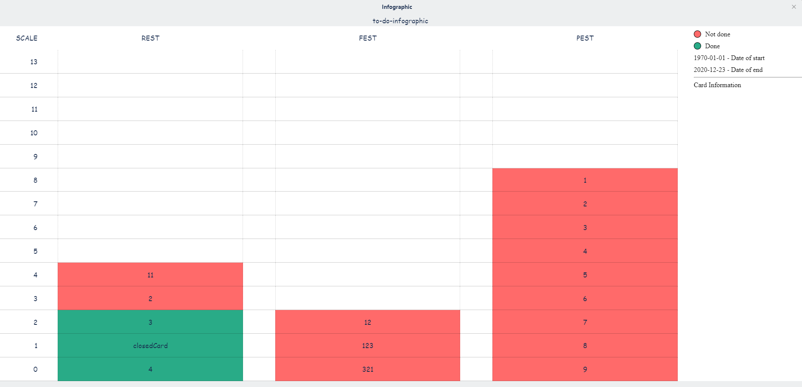

# trello to do infographics

Trello power-up application for demonstrate the completed tasks relative to all with the ability to filter by date.
### what can it do
  - Show unfinished tasks as red blocks
  - Show finished tasks as green blocks
  - Show card information in separate window (name, last activity date)
  - Show list information in separate window (how many cards, how many completed)

### how it looks like
  

### what will be able to do
  - Perhaps the application will be hosted on the Trello platform 
### how to add
  - Only as custom power-up

License
----

MIT
