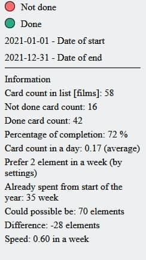

# trello to do infographics

Trello power-up application for demonstrate the completed tasks relative to all with the ability to filter by date.
### what can it do
  - Show unfinished tasks as red blocks
  - Show finished tasks as green blocks
  - Show card information in separate window (name, last activity date)
  - Show list information in separate window (how many cards, how many completed)

### how it looks like in common
  

### what information about card and list can I see
|Information|Picture|
|---|---|
|Information block contains data from you card list   and some calculated values based on your settings| |

### Can create pretty report .html for you by whole year period, example new year report
  

### what will be able to do
  - Perhaps the application will be hosted on the Trello platform 
### how to add
  - Only as custom power-up

License
----

MIT
